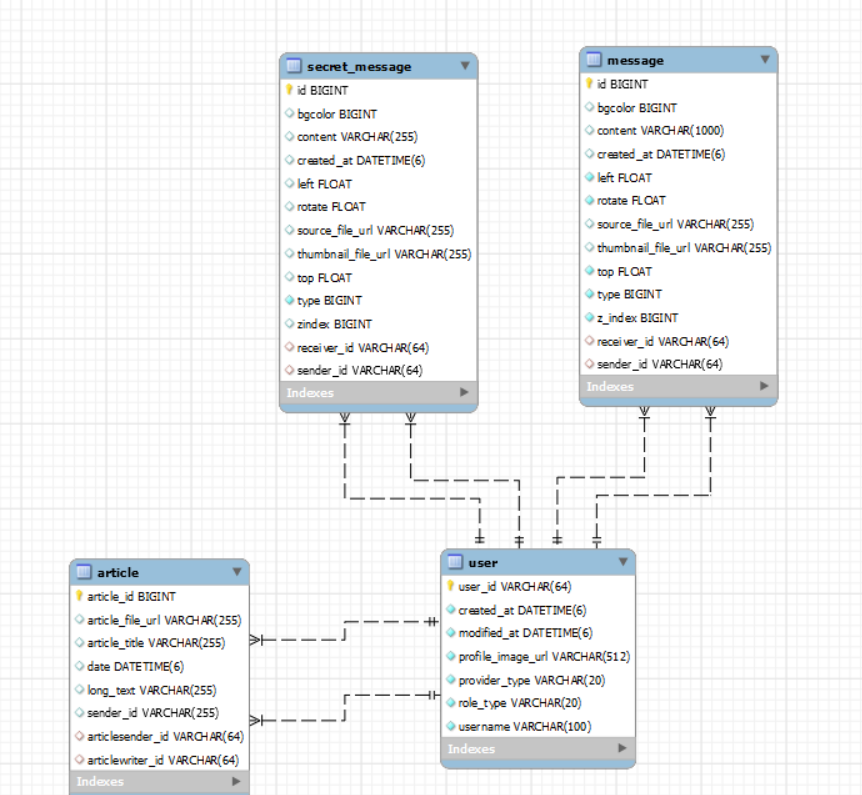
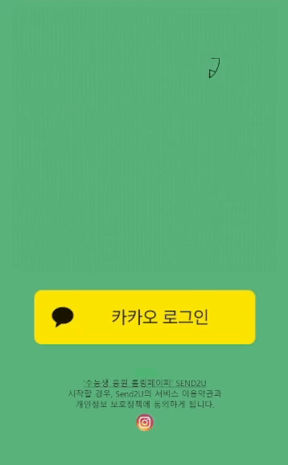
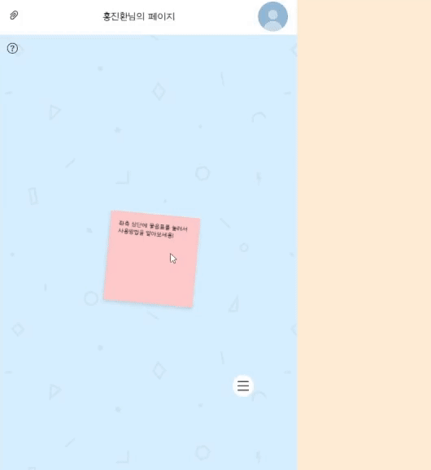
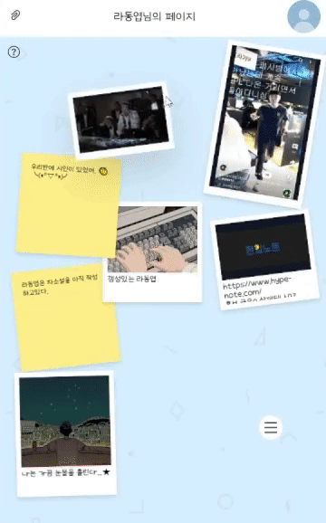
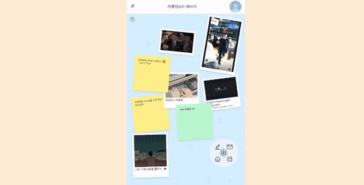
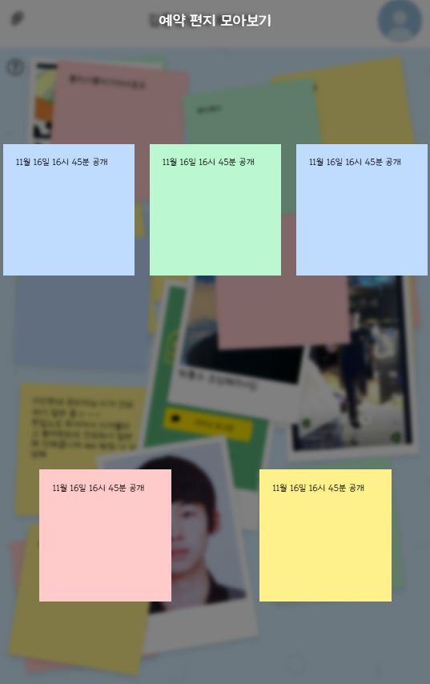
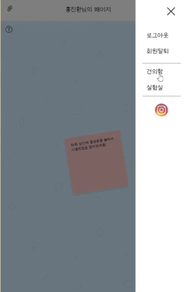
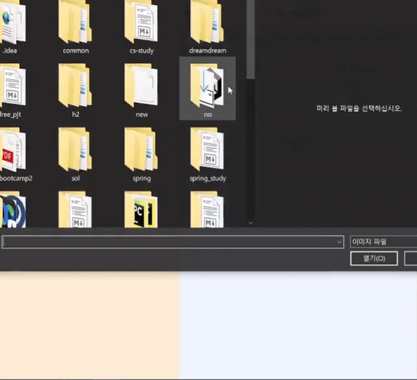

# 📧 SEND2U (수능 응원 메시지 작성 서비스)

 

 
  

  <h1>SEND2U
  <h3>수능생들을 위한 응원 메시지 작성 서비스
</h3>

<!-- 
<a href="https://(UCC링크)">🎥 UCC 보러 가기</a>
 -->
 

## 📅 기간

- **2023.10.09 ~ 2023.11.17(6주)**

 

## 🔎 목차

1. <a href="#subject">🎯 기획 배경</a>
1. <a href="#mainContents">⭐️ 주요 기능</a>
1. <a href="#systemArchitecture">⚙️ 시스템 아키텍쳐</a>
1. <a href="#skills">🛠️ 기술 스택</a>
1. <a href="#erd">💾 ERD</a>
1. <a href="#contents">🖥️ 화면 소개</a>
1. <a href="#developers">👥 팀원 소개</a>

 

<!------- 주제 시작 -------->

## 🎯 기획 배경

**SEND2U**

**수능 응원 메시지 서비스**

1. <b> 중요한 시험 </b>

- 수능은 학생들에게 19년의 학창시절이 한 번의 시험으로 결정되는 아주 중요한 시험입니다. 그 중요성 때문에 학생들은 많은 부담감을 느낍니다.
   

2. <b> 부담감의 해소 </b>

- SEND2U는 그런 학생들의 부담감을 조금이라도 해소하고자 합니다. 서로의 응원의 메시지를 공유하고 퍼트리면서, 그 부담감을 함께 나누고 위로를 얻을 수 있는 공간을 제공합니다.
   

3. <b> 마음의 선물 </b>

- SEND2U는 서로에게 응원의 메시지를 전달하는 서비스입니다. 부모님뿐만 아니라 친구, 선생님, 그리고 모든 사람들이 수능생에게 마음을 전달할 수 있는 플랫폼입니다.
   

4. <b>기다림의 선물</b>

- END2U는 수능이 끝난 후에 공개되는 비밀 응원 메시지 기능을 제공합니다. 수능을 치룬 학생들에게는 끝난 후에 받을 수 있는 응원의 메시지가 또 다른 선물이 될 것입니다.
   

**"SEND2U"** 는 이런 배경에서 시작된 서비스로, 모든 사람들이 수능생들에게 응원의 메시지를 전달할 수 있는 공간입니다. 부모님, 친구, 선생님 등 모든 사람들이 자신의 마음을 담은 응원의 메시지를 작성하고, 그 메시지를 수능생에게 전달할 수 있습니다. 이런 과정을 통해, 수능을 준비하는 학생들에게 많은 사람들의 응원과 사랑이 전달되며, 그들에게 큰 힘이 되어주기를 바라는 마음으로 기획하게 되었습니다.
 

<!------- 주요 기능 시작 -------->

## ⭐️ 주요 기능

### 텍스트, 사진, 영상 메시지 / 비밀 메시지 작성

- 사용자는 텍스트, 사진, 영상을 통해 응원 메시지를 작성할 수 있습니다. 또한, 수능이 끝난 후에 공개될 비밀 메시지도 미리 작성해두실 수 있습니다.

---

### 드래그 드롭을 이용한 메시지 배치

- 작성된 메시지는 드래그와 드롭을 이용해 원하는 위치에 배치할 수 있습니다. 이를 통해 사용자는 자신만의 메시지 레이아웃을 만들 수 있습니다.

---

### 메시지 / 비밀 메시지 모아보기

- 작성된 메시지와 비밀 메시지는 모아서 볼 수 있습니다. 이를 통해 사용자는 다른 사람들이 보낸 메시지를 한눈에 확인하며, 다양한 응원의 메시지를 받아볼 수 있습니다.

---

### 링크 공유 기능

- 작성된 메시지는 링크를 통해 공유할 수 있습니다. 이 링크를 통해 다른 사람들에게 응원의 메시지를 전달하거나, 자신이 받은 응원의 메시지를 공유할 수 있습니다.

### 얼굴 유사도 측정 및 합성

- 재미를 위한 기능으로 두 사람의 얼굴을 합성하고 유사도를 측정할 수 있습니다.

<a href="#tableContents">목차로 이동</a>

 

<!------- 시스템 아키텍쳐 시작 -------->

## ⚙️ 시스템 아키텍쳐

<a href="#tableContents">목차로 이동</a>

 

<!------- 기술 스택 시작 -------->

## 🛠️ 기술 스택

<!-- -(색깔)?style=for-the-badge&logo=(이름)&logoColor=white>) -->

### 프론트

  

 

##  

### 백엔드

   

   

 

---

### 협업

   

<a href="#tableContents">목차로 이동</a>

 

<!------- ERD 시작 -------->

## 💾 ERD

<a href="#tableContents">목차로 이동</a>

 

<!------- 화면 소개 시작 -------->

 

## 🖥️ 화면 소개

### 1. 로그인 페이지

- 카카오 로그인을 구현하여 간편하게 로그인이 가능합니다.

### 2. 서비스 소개 기능

- 처음에 왼쪽 상단 물음표를 클릭하라는 메시지
- 서비스의 대략적인 기능을 소개 해줍니다.

### 3. 메시지 작성 기능

- 공유받은 링크를 통해서 친구페이지 입장합니다.
- 일반 메시지를 작성할 수 있고 여러 색깔 선택가능합니다.
- 편지를 간단히 이동할 수 있습니다.
- 비밀편지 예약전송을 클릭하면 비밀메시지로 작성됩니다.

### 4. 사진/영상 메시지 작성 기능

- 사진과 동영상 메시지도 작성가능합니다.

### 5. 비밀 메시지 확인

- 수능 날짜에 맞춰서 수능이 끝나고 나왔을 때 확인 할 수 있습니다.

### 6. 건의함 기능

- 실제 유저와 소통하기 위한 기능입니다.
- 유저들은 건의사항을 작성할 수 있습니다.

### 7. 얼굴 바꾸기 기능

- 간단한 흥미를 위한 기능입니다.
- 두 명의 얼굴을 합성해서 다운로드할 수 있습니다.

## 🖥️ 기술

### 1. SERVER

- corntab을 활용해 3시간마다 db 백업, 3일 지난 백업 파일은 삭제
- S3에 저장된 파일 send2u.site 에서 만 접근 가능하게 설정

### 2. BACKEND

- AES를 이용해 DB에 비밀 메시지 암호화 저장
- Redis를 활용하여 refresh 토큰을 관리, 로그아웃 시 블랙리스트 구현

### 3. FRONTEND

- 커스텀 drag, double tap, long press event 구현
- 데스크탑 및 모바일 환경에서 자유롭게 배치가능
- 데스크탑, 안드로이드, ios 환경을 충족

### 4. AI

- RetinaFace와 ArcFace 모델을 사용하여 얼굴 유사도 측정
- Dlib 라이브러리를 사용하여 얼굴 바꾸기

<a href="#tableContents">목차로 이동</a>

 

 
<!------- 팀원 소개 시작 -------->

## 👥 팀원 소개

|   **Name**   |              김창혁              |              김동현              |              홍진환              |              홍정현              |              정재범              |              라동엽              |
| :----------: | :------------------------------: | :------------------------------: | :------------------------------: | :------------------------------: | :------------------------------: | :------------------------------: |
| **Profile**  |  |  |  |  |  |  |
| **Position** |       Leader   Server        |             Backend              |             Backend              |             Frontend             |             Frontend             |                AI                |

<a href="#tableContents">목차로 이동</a>

